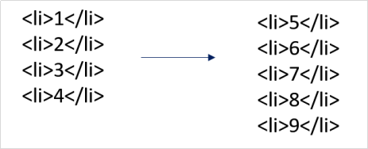
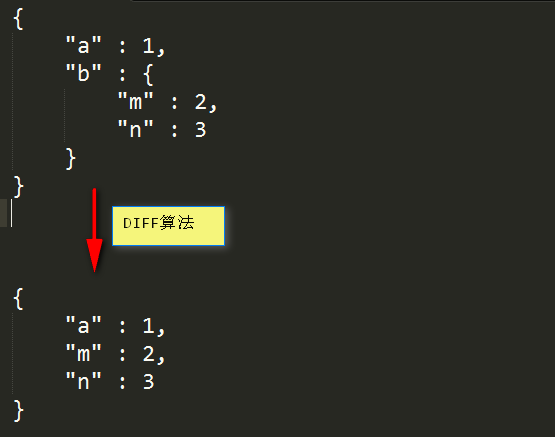
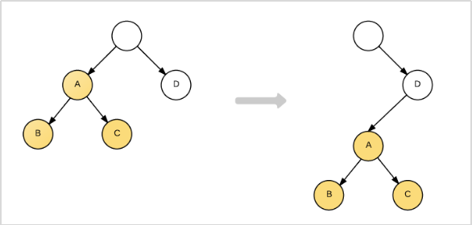
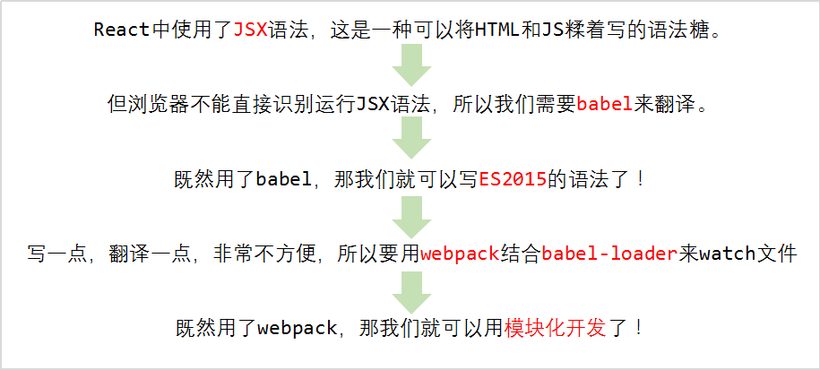

# React基础（我认为）

## 简介

来自Facebook，2013年诞生。

- **和Angular不同，React并不是一个完整的MVC/MVVM框架，它只专注于提供清晰、直接的View视图层解决方案。**它的功能全部以构建组件视图为核心，并提供类似控制器的函数接口和生命周期函数。在React中没有控制器、没有服务、没有指令、没有过滤器等等。

- **React非常轻**，目标是Minimal API interface，只提供组件化相关的非常少量的API。**简化了一切可以简化的东西**。比如说Angular中做一个组件，实际上叫做E级别的指令，要写scope、link函数，但是React最大限度的简化了一个组件的开发。事实上React就是为了组件开发而诞生的。

- **React可以搭配Flux等架构（Redux实现）使用。**有Flux架构护航，数据的单向流动，自称是比MVC、MVVM更高级的一种模式。可以开发大型应用的。

- **React使用Virtual DOM技术，**使得它性能卓越，开销很小。


## Virtual DOM

​	Virtual DOM是React中的一个很重要的概念，在日常开发中，前端工程师们需要将后台的数据呈现到界面中，同时要能对用户的操作提供反馈，作用到UI上…… 这些都离不开DOM操作。但是我们知道，**频繁的DOM操作会造成极大的资源浪费，也通常是性能瓶颈的原因。于是React 引入了Virtual DOM。Virtual DOM的核心就是***计算比较改变前后的DOM区别，然后用最少的DOM操作语句对DOM进行操作。

​	比如说要进行这样的DOM转换：



不用Virtual DOM技术：删除4个li，插入5个li。

使用Virtual DOM技术：通过计算，我们只需要改变4个li的innerHTML，并且插入一个li即可。

 

### DIFF算法

Virtual DOM技术使用了DIFF算法，DIFF算法是一个比较计算层次结构区别的算法，现在主要用来计算DOM之间的差异。



用DIFF算法可以计算两个JSON结构之间的差别。



现在DIFF算法为Virtual DOM技术服务，用来比较DOM结构的差异：

如果不使用Virtual DOM技术，此时要删除3个节点，插入3个节点。使用Virtual DOM技术仅仅需要移动节点即可。


### JSX语法糖

**React中使用JSX语法糖**，JSX = JavaScript + XML。js文件中写HTML模板，代码语境不需要来回切换的。也就是说，在Angular中模板写在.html文件中。React中使用.js文件来当做HTML模板，语境是统一的，非常清晰简明。jsx语法比``运算符还要简单，是最优雅的将HTML和JS结合的方案。

官网文档：http://reactjs.cn/react/index.html

菜鸟教程的文档不错：http://www.runoob.com/react/react-tutorial.html
中文翻译的手册：http://www.css88.com/react/docs/why-react.html


## React配置和Hello World

### React配置（webpack）

我们创建一个项目文件夹01_HelloWorld，在这个文件夹中，配置webpack + babel环境。让webpack可以指导babel翻译ES6语法。



#### 基本配置

创建package.json项目身份证：

```
$ npm init -y
```

安装webpack，并且设置为项目依赖：

```
$ npm install --save-dev webpack
```

当然你必须之前已经在-g下安装过webpack。

我们创建一个webpack.config.js文件，这个文件是webpack工作的参考。

我们对着https://webpack.js.org/configuration/  这个文档来创建webpack.config.js文件。

webpack.config.js文件：

```
const path = require('path');
module.exports = {
    entry: "./app/main.js",  
    output: {
        path: path.resolve(__dirname, "dist"),
        filename: "all.js"
    }
}
```

至此，我们的webpack就已经可以进行标准的CMD模块化开发了。

#### 引入ES6模块

我们引入babel-loader翻译ES6：

我们参考https://github.com/babel/babel-loader 改变webpack.config.js文件：

```
const path = require('path');
module.exports = {
    entry: "./app/main.js",  
    output: {
        path: path.resolve(__dirname, "dist"),
        filename: "all.js"
    },
    module: {
		rules: [
			{
				test: /\.js$/,
				exclude: /(node_modules|bower_components)/ ,
				use: {
					loader: 'babel-loader',
					options: {
				  		presets: ['es2015']
					}
				}
			}
		]
	}
}
```

友情提醒：webpack1和2在配置上差别最大的就是loader的书写方法。module → rules → test/use属性，这是标准webpack2的写法。

安装：

```
$ npm intall --save-dev babel-loader
$ npm intall --save-dev babel-core
$ npm intall --save-dev babel-preset-es2015
```

此时运行

$ webpack

命令，将自动的使用CMD构建app文件夹中main.js文件，并且使用babel翻译。


#### 配置react

```
$ npm install --save-dev react
$ npm install --save-dev react-dom
$ npm install --save-dev babel-preset-react
```

你可能会问：

① react为什么不是bower来安装，而是npm来安装

② 为什么是save-dev而不是save，也就是说为什么是开发依赖，而不是运行依赖。

稍后配置完毕解答。

改变webpack.config.js文件，增加一个babel翻译的配置项presets

```
const path = require('path');

module.exports = {
    entry: "./app/main.js",  
    output: {
        path: path.resolve(__dirname, "dist"),
        filename: "all.js"
    },
    module: {
		rules: [
			{
				test: /\.js$/,
				exclude: /(node_modules|bower_components)/ ,
				use: {
					loader: 'babel-loader',
					options: {
				  		presets: ['es2015','react']
					}
				}
			}
		]
	}
}
```

至此我们已经配置完毕react起步的所有的依赖，我们目前的package.json文件：

```
{
  "name": "01",
  "version": "1.0.0",
  "description": "",
  "main": "index.js",
  "scripts": {
    "test": "echo \"Error: no test specified\" && exit 1"
  },
  "author": "",
  "license": "ISC",
  "devDependencies": {
    "babel-core": "^6.24.1",
    "babel-loader": "^6.4.1",
    "babel-preset-es2015": "^6.24.1",
    "babel-preset-react": "^6.24.1",
    "react": "^15.5.4",
    "react-dom": "^15.5.4",
    "webpack": "^2.4.1"
  }
}
```


### Hello World

创建app/App.js文件，这是一个组件：

```
import React , {Component} from "react";
//我们定义一个叫做App的组件，在HTML中可以用<App></App>来使用它
//React要求自定义组件必须是大写字母开头！
//React要求自定义组件的类必须继承于React.Component类
class App extends Component{
	//组件中最重要的方法就是render方法，render是渲染的意思
	render(){
		//返回一个jsx语法，非常牛逼语法
		return <h1>我是React，很高兴遇见你！说{5000+5000}次我爱你！</h1>;
	}
}
//向外暴露
export default App;
```

下面就要使用这个App组件，所以我们来到/app/main.js文件：

```
import React from "react";
import {render} from "react-dom";
//引入组件
import App from "./App.js";

//使用、挂载组件，两个参数
//第一个参数是jsx语法
//第二个参数表示组件挂在哪里
render(
	<App></App> , 
	document.getElementById("app-container")
);
```

